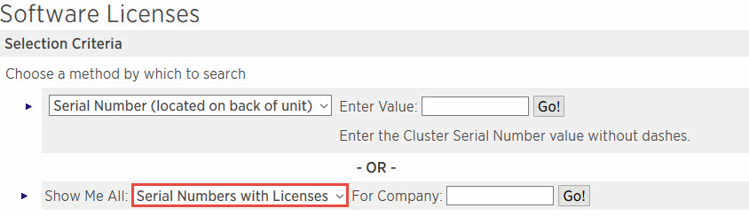

= SnapCenter 표준 용량 기반 라이센스 추가
:allow-uri-read: 
:icons: font
:imagesdir: ../media/

[role="lead"]
SnapCenter 표준 용량 라이센스를 사용하여 ONTAP Select 및 Cloud Volumes ONTAP 플랫폼의 데이터를 보호할 수 있습니다.

용량 라이센스의 특징은 다음과 같습니다.

* 51xxxxxxx 형식의 9자리 일련 번호로 구성됩니다
+
라이센스 일련 번호 및 유효한 NetApp Support 사이트 로그인 자격 증명을 사용하여 SnapCenter GUI를 통해 라이센스를 활성화합니다.

* 사용된 스토리지 용량 또는 보호할 데이터의 크기 중 더 낮은 것을 기준으로 비용을 설정하고 SnapCenter에서 데이터를 관리하는 별도의 영구 라이센스로 사용할 수 있습니다
* 테라바이트당 가용성
+
예를 들어, 1TB, 2TB, 4TB 등에 대한 용량 기반 라이센스를 얻을 수 있습니다.

* 100TB 용량 사용 권한이 있는 90일 평가판 라이센스로 제공됩니다
+
필요한 라이센스에 대한 자세한 내용은 를 참조하십시오 link:../install/concept_snapcenter_licenses.html["SnapCenter 라이센스"^].

SnapCenter는 Cloud Volumes ONTAP 및 관리하는 ONTAP Select 스토리지에서 매일 자정에 용량 사용량을 자동으로 계산합니다. 표준 용량 라이센스를 사용하는 경우 SnapCenter는 총 라이센스 용량에서 모든 볼륨에 사용된 용량을 추론하여 사용하지 않은 용량을 계산합니다. 사용된 용량이 라이센스 용량을 초과하면 SnapCenter 대시보드에 초과 사용 경고가 표시됩니다. SnapCenter에서 용량 임계값 및 알림을 구성한 경우 사용된 용량이 지정한 임계값에 도달하면 이메일이 전송됩니다.

=== 1단계: 용량 요구 사항 계산

SnapCenter 용량 기반 라이센스를 얻기 전에 SnapCenter에서 관리할 호스트의 용량을 계산해야 합니다.

Cloud Volumes ONTAP 또는 ONTAP Select 시스템에서 클러스터 관리자여야 합니다.

.이 작업에 대해
SnapCenter는 사용된 실제 용량을 계산합니다. 파일 시스템 또는 데이터베이스의 크기가 1TB이지만 500GB의 공간만 사용되는 경우 SnapCenter는 500GB의 사용된 용량을 계산합니다. 볼륨 용량은 중복제거 및 압축 후 계산되며 전체 볼륨의 사용된 용량을 기준으로 계산됩니다.

.단계
. ONTAP 명령줄을 사용하여 NetApp 컨트롤러에 로그인합니다.
. 사용된 볼륨 용량을 보려면 명령을 입력합니다.
+
[listing]
----
select::> vol show -fields used -volume Engineering,Marketing
vserver volume       used
------- ------       ------
VS1     Engineering  2.13TB
VS1     Marketing    2.62TB

2	entries were displayed.
----
+
두 볼륨의 사용된 총 용량은 5TB 미만입니다. 따라서 모든 5TB 데이터를 보호하려면 최소 SnapCenter 용량 기반 라이센스 요구사항이 5TB 이상입니다.

+
그러나 총 사용 용량 5TB의 2TB만 보호하려면 2TB 용량 기반 라이센스를 얻을 수 있습니다.

=== 2단계: 용량 기반 라이센스의 일련 번호를 검색합니다

SnapCenter 용량 기반 라이센스 일련 번호는 주문 확인 또는 문서 패키지에서 사용할 수 있습니다. 하지만 이 일련 번호가 없는 경우 NetApp Support 사이트에서 검색할 수 있습니다.

유효한 NetApp Support 사이트 로그인 자격 증명이 있어야 합니다.

.단계
. 에 로그인합니다 http://mysupport.netapp.com/["NetApp Support 사이트"^].
. 시스템 * > * 소프트웨어 라이센스 * 로 이동합니다.
. 선택 기준 영역의 모두 표시: 일련 번호 및 라이센스 드롭다운 메뉴에서 * SC_STANDARD * 를 선택합니다.
+

. 회사 이름을 입력한 다음 * Go! * 를 선택합니다.
+
51xxxxxxx 형식의 9자리 SnapCenter 라이센스 일련 번호가 표시됩니다.

. 일련 번호를 기록합니다.

=== 3단계: NetApp 라이센스 파일을 생성합니다

SnapCenter GUI에 NetApp Support 사이트 자격 증명과 SnapCenter 라이센스 일련 번호를 입력하지 못하거나 SnapCenter에서 NetApp Support 사이트에 인터넷에 액세스할 수 없는 경우 NetApp 라이센스 파일(NLF)을 생성할 수 있습니다. 그런 다음 SnapCenter 호스트에서 액세스할 수 있는 위치에 파일을 다운로드하여 저장할 수 있습니다.

.시작하기 전에
* ONTAP Select를 SnapCenter 또는 Cloud Volumes ONTAP와 함께 사용해야 합니다.
* 유효한 NetApp Support 사이트 로그인 자격 증명이 있어야 합니다.
* 51xxxxxxx 형식의 라이센스 일련 번호는 9자리 숫자여야 합니다.

.단계
. 로 이동합니다 https://register.netapp.com/register/eclg.xwic["NetApp 라이센스 파일 생성기"^].
. 필요한 정보를 입력합니다.
. 제품 라인 필드의 풀다운 메뉴에서 * SnapCenter 표준(용량 기반) * 을 선택합니다.
. 제품 일련 번호 필드에 SnapCenter 라이센스 일련 번호를 입력합니다
. NetApp 데이터 개인 정보 보호 정책을 읽고 동의한 다음 * 제출 * 을 선택합니다.
. 라이센스 파일을 저장한 다음 파일 위치를 기록합니다.

=== 4단계: 용량 기반 라이센스 추가

ONTAP Select 또는 Cloud Volumes ONTAP 플랫폼과 함께 SnapCenter를 사용하는 경우 SnapCenter 용량 기반 라이센스를 하나 이상 설치해야 합니다.

.시작하기 전에
* SnapCenter 관리자로 로그인해야 합니다.
* 유효한 NetApp Support 사이트 로그인 자격 증명이 있어야 합니다.
* 51xxxxxxx 형식의 라이센스 일련 번호는 9자리 숫자여야 합니다.
+
NetApp 라이센스 파일(NLF)을 사용하여 라이센스를 추가하는 경우 라이센스 파일의 위치를 알아야 합니다.

.이 작업에 대해
설정 페이지에서 다음 작업을 수행할 수 있습니다.

* 라이센스를 추가합니다.
* 라이센스 세부 정보를 보고 각 라이센스에 대한 정보를 빠르게 찾습니다.
* 라이센스 용량을 업데이트하거나 임계값 알림 설정을 변경하는 등 기존 라이센스를 대체하려는 경우 라이센스를 수정합니다.
* 기존 라이센스를 교체하려는 경우 또는 라이센스가 더 이상 필요하지 않은 경우 라이센스를 삭제합니다.
+

NOTE: 평가판 라이센스(일련 번호가 50으로 끝나는 번호)는 SnapCenter GUI를 사용하여 삭제할 수 없습니다. 조달된 SnapCenter 표준 용량 기반 라이센스를 추가하면 평가판 라이센스가 자동으로 덮어쓰여집니다.

.단계
. 왼쪽 탐색 창에서 * 설정 * 을 선택합니다.
. 설정 페이지에서 * 소프트웨어 * 를 선택합니다.
. 소프트웨어 페이지의 라이센스 섹션에서 * 추가 * (image:../media/add_policy_from_resourcegroup.gif["더하기 아이콘"])를 클릭합니다.
. SnapCenter 라이센스 추가 마법사에서 다음 방법 중 하나를 선택하여 추가할 라이센스를 가져옵니다.
+
|===
| 이 필드의 내용... | 수행할 작업... 

 a| 
NSS(NetApp Support Site) 로그인 자격 증명을 입력하여 라이센스를 가져옵니다
 a| 
.. NSS 사용자 이름을 입력합니다.
.. NSS 암호를 입력합니다.
.. 컨트롤러 기반 라이센스의 일련 번호를 입력합니다.

 a| 
NetApp 라이센스 파일
 a| 
.. 라이센스 파일의 위치를 찾은 다음 선택합니다.
.. 열기 * 를 선택합니다.

|===
. 알림 페이지에서 SnapCenter에서 이메일, EMS 및 AutoSupport 알림을 보내는 용량 임계값을 입력합니다.
+
기본 임계값은 90%입니다.

. 이메일 알림에 맞게 SMTP 서버를 구성하려면 * 설정 * > * 글로벌 설정 * > * 알림 서버 설정 * 을 선택한 후 다음 세부 정보를 입력합니다.
+
|===
| 이 필드의 내용... | 수행할 작업... 

 a| 
이메일 기본 설정
 a| 
Always * 또는 * Never * 중에서 선택합니다.

 a| 
이메일 설정을 제공합니다
 a| 
Always * 를 선택한 경우 다음을 지정합니다.

** 보낸 사람 이메일 주소입니다
** 수신자 이메일 주소입니다
** 선택 사항: 기본 제목 줄을 편집합니다
+
기본 제목은 "SnapCenter 라이센스 용량 알림"입니다.

|===
. 스토리지 시스템 syslog에 EMS(이벤트 관리 시스템) 메시지를 보내거나 스토리지 시스템에 실패한 작업을 위한 AutoSupport 메시지를 보내려면 적절한 확인란을 선택합니다. 발생할 수 있는 문제를 해결하려면 AutoSupport를 활성화하는 것이 좋습니다.
. 다음 * 을 선택합니다.
. 요약을 검토한 후 * Finish * 를 선택합니다.

