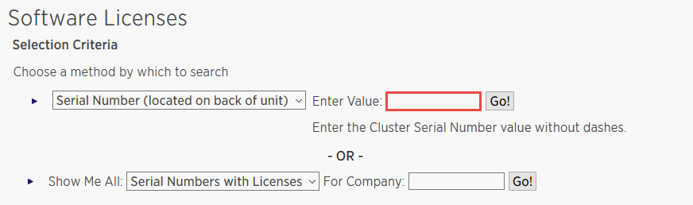

= SnapCenter 표준 컨트롤러 기반 라이센스를 추가합니다
:allow-uri-read: 
:icons: font
:imagesdir: ../media/

[role="lead"]
FAS 또는 AFF 스토리지 컨트롤러를 사용하는 경우 SnapCenter 표준 컨트롤러 기반 라이센스가 필요합니다.

컨트롤러 기반 라이센스는 다음과 같은 특성을 가지고 있습니다.

* 프리미엄 또는 플래시 번들 구매 시 SnapCenter 표준 자격 포함(기본 팩 제외)
* 무제한 저장소 사용
* FAS System Manager 또는 스토리지 클러스터 명령줄을 사용하여 AFF 또는 ONTAP 스토리지 컨트롤러에 직접 추가하여 사용 가능
+

NOTE: SnapCenter 컨트롤러 기반 라이센스의 경우 SnapCenter GUI에 라이센스 정보를 입력하지 않습니다.

* 컨트롤러의 일련 번호에 잠금 상태입니다

필요한 라이센스에 대한 자세한 내용은 를 참조하십시오 link:../install/concept_snapcenter_licenses.html["SnapCenter 라이센스"^].

== 컨트롤러 기반 라이센스를 추가하기 위한 사전 요구사항

컨트롤러 기반 라이센스를 추가하기 전에 SnapManager Suite 라이센스가 설치되어 있는지 확인하고, 컨트롤러에 설치된 라이센스를 식별하고, 컨트롤러의 일련 번호를 검색하고, 컨트롤러 기반 라이센스의 일련 번호를 검색해야 합니다.

=== SnapManager Suite 라이센스가 설치되어 있는지 확인합니다

SnapCenter GUI를 사용하면 SnapManager 제품군 라이센스가 FAS 또는 AFF 운영 스토리지 시스템에 설치되어 있는지 여부를 확인하고 SnapManager 제품군 라이센스가 필요할 수 있는 스토리지 시스템을 식별할 수 있습니다. SnapManager 제품군 라이센스는 AFF 및 FAS SVM이나 운영 스토리지 시스템의 클러스터에만 적용됩니다.

NOTE: 컨트롤러에 SnapManager Suite 라이센스가 이미 있는 경우 SnapCenter 표준 컨트롤러 기반 라이센스 권한이 자동으로 제공됩니다. SnapManager 라이센스 및 SnapCenter 표준 컨트롤러 기반 라이센스 이름은 서로 바꿔서 사용되지만 동일한 라이센스를 나타냅니다.

* 단계 *

. 왼쪽 탐색 창에서 * 스토리지 시스템 * 을 클릭합니다.
. 스토리지 시스템 페이지의 * 유형 * 드롭다운에서 추가된 모든 SVM 또는 클러스터를 표시할지 여부를 선택합니다.
+
** 추가된 모든 SVM을 보려면 * ONTAP SVM * 을 선택합니다.
** 추가된 모든 클러스터를 보려면 * ONTAP 클러스터 * 를 선택합니다.
+
클러스터 이름을 클릭하면 클러스터에 포함된 모든 SVM이 스토리지 가상 시스템 섹션에 표시됩니다.

. Storage Connections 목록에서 Controller License 열을 찾습니다.
+
컨트롤러 라이센스 열에는 다음 상태가 표시됩니다.

+
** image:../media/controller_licensed_icon.gif[""] SnapManager Suite 라이센스가 FAS 또는 AFF 운영 스토리지 시스템에 설치되어 있음을 나타냅니다.
** image:../media/controller_not_licensed_icon.gif[""] SnapManager Suite 라이센스가 FAS 또는 AFF 운영 스토리지 시스템에 설치되어 있지 않음을 나타냅니다.
** 해당 없음 은 스토리지 컨트롤러가 Cloud Volumes ONTAP, ONTAP Select 또는 보조 스토리지 플랫폼에 있기 때문에 SnapManager Suite 라이센스가 적용되지 않음을 나타냅니다.

=== 컨트롤러에 설치된 라이센스를 확인합니다

ONTAP 명령줄을 사용하여 컨트롤러에 설치된 모든 라이센스를 볼 수 있습니다. FAS 또는 AFF 시스템에서 클러스터 관리자여야 합니다.

NOTE: SnapCenter 표준 컨트롤러 기반 라이센스는 컨트롤러에 SnapManagerSuite 라이센스로 표시됩니다.

* 단계 *

. ONTAP 명령줄을 사용하여 NetApp 컨트롤러에 로그인합니다.
. license show 명령을 입력한 다음 출력을 확인하여 SnapManagerSuite 라이센스가 설치되었는지 확인합니다.
+
[listing]
----
cluster1::> license show
(system license show)

Serial Number: 1-80-0000xx
Owner: cluster1
Package           Type     Description              Expiration
----------------- -------- ---------------------    ---------------
Base              site     Cluster Base License     -

Serial Number: 1-81-000000000000000000000000xx
Owner: cluster1-01
Package           Type     Description              Expiration
----------------- -------- ---------------------    ---------------
NFS               license  NFS License              -
CIFS              license  CIFS License             -
iSCSI             license  iSCSI License            -
FCP               license  FCP License              -
SnapRestore       license  SnapRestore License      -
SnapMirror        license  SnapMirror License       -
FlexClone         license  FlexClone License        -
SnapVault         license  SnapVault License        -
SnapManagerSuite  license  SnapManagerSuite License -
----
+
이 예제에서는 SnapManagerSuite 라이센스가 설치되어 있으므로 추가 SnapCenter 라이센스 작업이 필요하지 않습니다.

=== 컨트롤러의 일련 번호를 검색합니다

컨트롤러 기반 라이센스의 일련 번호를 검색하려면 컨트롤러 일련 번호가 필요합니다. ONTAP 명령줄을 사용하여 컨트롤러 일련 번호를 검색할 수 있습니다. FAS 또는 AFF 시스템에서 클러스터 관리자여야 합니다.

* 단계 *

. ONTAP 명령줄을 사용하여 컨트롤러에 로그인합니다.
. system show-instance 명령을 입력한 다음 출력을 검토하여 컨트롤러 일련 번호를 찾습니다.
+
[listing]
----
cluster1::> system show -instance

Node: fas8080-41-42-01
Owner:
Location: RTP 1.5
Model: FAS8080
Serial Number: 123451234511
Asset Tag: -
Uptime: 143 days 23:46
NVRAM System ID: xxxxxxxxx
System ID: xxxxxxxxxx
Vendor: NetApp
Health: true
Eligibility: true
Differentiated Services: false
All-Flash Optimized: false

Node: fas8080-41-42-02
Owner:
Location: RTP 1.5
Model: FAS8080
Serial Number: 123451234512
Asset Tag: -
Uptime: 144 days 00:08
NVRAM System ID: xxxxxxxxx
System ID: xxxxxxxxxx
Vendor: NetApp
Health: true
Eligibility: true
Differentiated Services: false
All-Flash Optimized: false
2 entries were displayed.
----
. 일련 번호를 기록합니다.

=== 컨트롤러 기반 라이센스의 일련 번호를 검색합니다

FAS 또는 AFF 스토리지를 사용하는 경우 ONTAP 명령줄을 사용하여 설치하기 전에 NetApp Support 사이트에서 SnapCenter 컨트롤러 기반 라이센스를 검색할 수 있습니다.

* 필요한 것 *

* 유효한 NetApp Support 사이트 로그인 자격 증명이 있어야 합니다.
+
유효한 자격 증명을 입력하지 않으면 검색에 대한 정보가 반환되지 않습니다.

* 컨트롤러의 일련 번호가 있어야 합니다.

* 단계 *

. NetApp Support 사이트 에 로그인합니다 http://mysupport.netapp.com/["mysupport.netapp.com"^].
. 시스템 * > * 소프트웨어 라이센스 * 로 이동합니다.
. 선택 기준 영역에서 일련 번호(장치 뒷면에 있음)가 선택되었는지 확인하고 컨트롤러 일련 번호를 입력한 다음 * Go! * 를 클릭합니다.
+

+
지정된 컨트롤러의 라이센스 목록이 표시됩니다.

. SnapCenter Standard 또는 SnapManagerSuite 라이센스를 찾아서 기록합니다.

== 컨트롤러 기반 라이센스를 추가합니다

ONTAP 명령줄을 사용하여 FAS 또는 AFF 시스템을 사용 중인 경우 SnapCenter 컨트롤러 기반 라이센스를 추가할 수 있으며 SnapCenter Standard 또는 SnapManagerSuite 라이센스가 있습니다.

* 필요한 것 *

* FAS 또는 AFF 시스템에서 클러스터 관리자여야 합니다.
* SnapCenter Standard 또는 SnapManagerSuite 라이센스가 있어야 합니다.

* 이 작업에 대한 정보 *

FAS 또는 AFF 스토리지를 사용해 평가판을 SnapCenter와 함께 설치하려면 컨트롤러에 설치할 Premium 번들 평가 라이센스를 받아야 합니다.

평가판을 통해 SnapCenter를 설치하려면 세일즈 담당자에게 문의하여 컨트롤러에 설치할 프리미엄 번들 평가 라이센스를 받아야 합니다.

* 단계 *

. ONTAP 명령줄을 사용하여 NetApp 클러스터에 로그인합니다.
. SnapManagerSuite 라이센스 키 추가:
+
'시스템 사용권 추가-사용권 코드 사용권_키'

+
이 명령은 admin 권한 수준에서 사용할 수 있습니다.

. SnapManagerSuite 라이센스가 설치되었는지 확인합니다.
+
'라이선스 쇼'

=== 평가판 라이센스를 제거합니다

컨트롤러 기반 SnapCenter 표준 라이센스를 사용하고 있으며 용량 기반 평가판 라이센스(일련 번호가 ""50"으로 끝나는 번호)를 제거해야 하는 경우 MySQL 명령을 사용하여 평가판 라이센스를 수동으로 제거해야 합니다. 평가판 라이센스는 SnapCenter GUI를 사용하여 삭제할 수 없습니다.

NOTE: SnapCenter 표준 컨트롤러 기반 라이센스를 사용하는 경우에만 평가판 라이센스를 수동으로 제거해야 합니다. SnapCenter 표준 용량 기반 라이센스를 조달하여 SnapCenter GUI에 추가하면 평가판 라이센스가 자동으로 덮어쓰여집니다.

* 단계 *

. SnapCenter 서버에서 PowerShell 창을 열어 MySQL 암호를 재설정합니다.
+
.. Open-SmConnection cmdlet을 실행하여 SnapCenter 서버에서 SnapCenterAdmin 계정에 대한 연결 세션을 시작합니다.
.. Set-SmRepositoryPassword를 실행하여 MySQL 암호를 재설정합니다.
+
cmdlet에 대한 자세한 내용은 을 참조하십시오 https://library.netapp.com/ecm/ecm_download_file/ECMLP2880726["SnapCenter 소프트웨어 cmdlet 참조 가이드"^].

. 명령 프롬프트를 열고 MySQL -u root -p 를 실행하여 MySQL에 로그인합니다.
+
MySQL에서 암호를 묻는 메시지를 표시합니다. 암호를 재설정하는 동안 제공한 자격 증명을 입력합니다.

. 데이터베이스에서 평가판 라이센스를 제거합니다.
+
'NSM 사용;''NSM_License_Serial_Number = '510000050'인 경우 NSM_License에서 삭제';'

