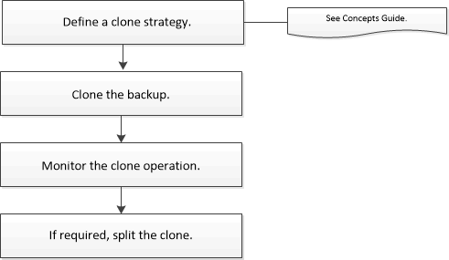

= 클론 복제 워크플로우
:allow-uri-read: 
:icons: font
:imagesdir: ../media/

[role="lead"]
클론 워크플로우에는 클론 작업 수행 및 작업 모니터링이 포함됩니다.

.이 작업에 대해
* 소스 IBM DB2 서버에서 클론을 생성할 수 있습니다.
* 다음과 같은 이유로 리소스 백업을 복제할 수 있습니다.
+
** 응용 프로그램 개발 주기 동안 현재 리소스 구조 및 콘텐츠를 사용하여 구현해야 하는 기능을 테스트합니다
** 데이터 웨어하우스를 채울 때 데이터 추출 및 조작 도구를 위한 것입니다
** 실수로 삭제 또는 변경된 데이터를 복구합니다

다음 워크플로에서는 클론 작업을 수행해야 하는 순서를 보여 줍니다.

PowerShell cmdlet을 수동으로 사용하거나 스크립트에서 사용하여 백업, 복원 및 클론 작업을 수행할 수도 있습니다. SnapCenter cmdlet 도움말 및 cmdlet 참조 정보에는 PowerShell cmdlet에 대한 자세한 정보가 포함되어 있습니다.

.작업을 마친 후
자동으로 검색된 DB2 리소스의 클론을 생성한 후 복제된 리소스는 수동 리소스로 표시됩니다. Refresh resources * 를 클릭하여 복제된 DB2 리소스를 복구합니다. 클론을 삭제하면 스토리지와 호스트도 정리됩니다.

클론 작업 후 리소스를 새로 고치지 않고 클론을 삭제하려고 하면 스토리지와 호스트가 정리되지 않습니다. fstab에서 항목을 수동으로 삭제해야 합니다.
