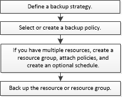

= 백업 워크플로우
:allow-uri-read: 
:icons: font
:imagesdir: ../media/

[role="lead"]
사용자 환경에 Microsoft SQL Server용 SnapCenter 플러그인을 설치하면 SnapCenter를 사용하여 SQL Server 리소스를 백업할 수 있습니다.

여러 서버에서 동시에 실행되도록 여러 백업을 예약할 수 있습니다.

동일한 리소스에서 백업 및 복원 작업을 동시에 수행할 수 없습니다.

다음 워크플로에서는 백업 작업을 수행해야 하는 순서를 보여 줍니다.

NOTE: NetApp이 아닌 LUN, 손상된 데이터베이스 또는 복원 중인 데이터베이스를 선택하면 Resources 페이지의 Backup Now, Restore, Manage Backups 및 Clone 옵션이 비활성화됩니다.

PowerShell cmdlet을 수동으로 또는 스크립트에서 사용하여 백업, 복원, 복구, 확인 및 클론 작업을 수행할 수도 있습니다. PowerShell cmdlet에 대한 자세한 내용은 SnapCenter cmdlet 도움말을 사용하거나 을 참조하십시오 https://library.netapp.com/ecm/ecm_download_file/ECMLP2885482["SnapCenter 소프트웨어 cmdlet 참조 가이드"]

== SnapCenter가 데이터베이스를 백업하는 방법

SnapCenter는 스냅샷 복사본 기술을 사용하여 LUN 또는 VMDK에 상주하는 SQL Server 데이터베이스를 백업합니다. SnapCenter은 데이터베이스의 스냅샷 복사본을 생성하여 백업을 생성합니다.

리소스 페이지에서 전체 데이터베이스 백업에 사용할 데이터베이스를 선택하면 SnapCenter는 동일한 스토리지 볼륨에 상주하는 다른 모든 데이터베이스를 자동으로 선택합니다. LUN 또는 VMDK에서 하나의 데이터베이스만 저장하는 경우 데이터베이스를 개별적으로 선택 또는 다시 선택할 수 있습니다. LUN 또는 VMDK에 여러 데이터베이스가 포함된 경우 데이터베이스를 그룹으로 선택 또는 다시 선택해야 합니다.

단일 볼륨에 상주하는 모든 데이터베이스가 Snapshot 복사본을 사용하여 동시에 백업됩니다. 최대 동시 백업 데이터베이스 수가 35이고 스토리지 볼륨에 데이터베이스가 35개 이상인 경우 생성되는 총 스냅샷 복사본 수는 데이터베이스 수를 35개로 나눈 값과 같습니다.

NOTE: 백업 정책의 각 스냅샷 복사본에 대한 최대 데이터베이스 수를 구성할 수 있습니다.

SnapCenter에서 스냅샷 복사본을 생성하면 전체 스토리지 시스템 볼륨이 스냅샷 복사본에 캡처됩니다. 그러나 백업은 백업이 생성된 SQL 호스트 서버에만 유효합니다.

다른 SQL 호스트 서버의 데이터가 동일한 볼륨에 상주하는 경우 스냅샷 복사본에서 이 데이터를 복원할 수 없습니다.

* 자세한 정보 찾기 *

link:task_back_up_resources_using_powershell_cmdlets_for_sql.html["PowerShell cmdlet을 사용하여 리소스를 백업합니다"]

link:https://kb.netapp.com/Advice_and_Troubleshooting/Data_Protection_and_Security/SnapCenter/Quiesce_or_grouping_resources_operations_fail["리소스 중지 또는 그룹화 작업이 실패했습니다"]
