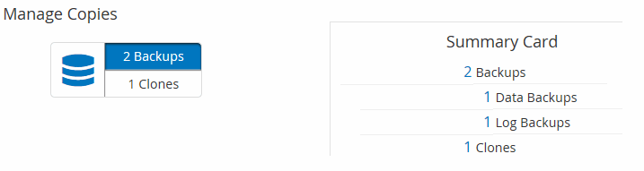

= 토폴로지 페이지에서 관련 백업 및 클론 보기
:allow-uri-read: 
:icons: font
:imagesdir: ../media/

[role="lead"]
리소스를 백업 또는 클론 복제할 때 운영 스토리지와 보조 스토리지의 모든 백업 및 클론을 그래픽으로 표시할 수 있습니다. 토폴로지 페이지에서 선택한 리소스 또는 리소스 그룹에 사용할 수 있는 모든 백업 및 클론을 볼 수 있습니다. 이러한 백업 및 클론의 세부 정보를 확인한 다음 이를 선택하여 데이터 보호 작업을 수행할 수 있습니다.

.이 작업에 대해
복제본 관리 보기에서 다음 아이콘을 검토하여 운영 스토리지 또는 보조 스토리지(미러 복사본 또는 볼트 복제본)에서 백업과 클론을 사용할 수 있는지 확인할 수 있습니다.

* image:../media/topology_primary_storage.gif["운영 스토리지 아이콘"] 기본 스토리지에서 사용할 수 있는 백업 및 클론 수를 표시합니다.
* image:../media/topology_mirror_secondary_storage.gif["보조 스토리지 미러 아이콘"] SnapMirror 기술을 사용하여 보조 스토리지에 미러링된 백업 및 클론 수를 표시합니다.
+

NOTE: 미러 볼트 유형 볼륨에 있는 버전에 유연한 미러 백업의 클론은 토폴로지 뷰에 표시되지만 토폴로지 뷰에 있는 미러 백업 카운트에 버전에 따라 유연하게 백업할 수 있는 백업이 포함되지 않습니다.

* image:../media/topology_vault_secondary_storage.gif["보조 볼트 아이콘"] SnapVault 기술을 사용하여 보조 스토리지에 복제된 백업 및 클론 수를 표시합니다.
+
** 표시된 백업 수에는 보조 스토리지에서 삭제된 백업이 포함됩니다. 예를 들어 정책을 사용하여 6개의 백업을 생성하여 4개의 백업만 보존한 경우 표시되는 백업 수는 6입니다.
** SnapCenter 1.1에서 업그레이드한 경우, 토폴로지 페이지의 미러 복사본 또는 볼트 사본 아래에 보조 복제본(미러 또는 볼트)의 클론이 표시되지 않습니다. SnapCenter 1.1을 사용하여 생성된 모든 클론은 SnapCenter 3.0의 로컬 복제본 아래에 표시됩니다.

NOTE: 미러 볼트 유형 볼륨에 있는 버전에 유연한 미러 백업의 클론은 토폴로지 뷰에 표시되지만 토폴로지 뷰에 있는 미러 백업 카운트에 버전에 따라 유연하게 백업할 수 있는 백업이 포함되지 않습니다.

2차 관계가 SnapMirror 액티브 동기화(처음에 SnapMirror Business Continuity[SM-BC]로 릴리스)로 설정된 경우 다음과 같은 추가 아이콘을 볼 수 있습니다.

* image:../media/topology_replica_site_up.png["복제 사이트가 작동 중입니다"] 는 복제 사이트가 작동 중임을 의미합니다.
* image:../media/topology_replica_site_down.png["복제 사이트가 다운되었습니다"]  는 복제 사이트가 다운되었음을 의미합니다.
* image:../media/topology_reestablished.png["관계가 재설정됩니다"] 2차 미러 또는 볼트 관계가 다시 설정되지 않았음을 의미합니다.

.단계
. 왼쪽 탐색 창에서 * 리소스 * 를 클릭한 다음 목록에서 적절한 플러그인을 선택합니다.
. 리소스 페이지의 * 보기 * 드롭다운 목록에서 리소스 또는 리소스 그룹을 선택합니다.
. 자원 세부 정보 보기 또는 자원 그룹 세부 정보 보기에서 자원을 선택합니다.
+
리소스가 보호되는 경우 선택한 리소스의 토폴로지 페이지가 표시됩니다.

. Summary 카드를 검토하여 운영 스토리지와 보조 스토리지에서 사용할 수 있는 백업 및 클론 수를 요약합니다.
+
요약 카드 섹션에는 총 백업 및 클론 수가 표시됩니다. Oracle 데이터베이스에만 해당하는 요약 카드 섹션에는 총 로그 백업 수가 표시됩니다.

+
Refresh * 버튼을 클릭하면 스토리지 쿼리가 시작되어 정확한 카운트를 표시합니다.

+
SnapLock 지원 백업을 수행한 경우 * 새로 고침 * 버튼을 클릭하면 ONTAP에서 검색된 운영 및 보조 SnapLock 만료 시간이 새로 고쳐집니다. 주별 스케줄은 ONTAP에서 검색된 운영 및 보조 SnapLock 만료 시간도 새로 고칩니다.

+
애플리케이션 리소스가 여러 볼륨에 분산되면 백업에 대한 SnapLock 만료 시간이 볼륨의 스냅샷에 대해 설정된 가장 긴 SnapLock 만료 시간이 됩니다. ONTAP에서 가장 긴 SnapLock 만료 시간을 검색합니다.

+
SnapMirror 활성 동기화의 경우 * 새로 고침 * 버튼을 클릭하면 기본 사이트와 복제 사이트 모두에 대해 ONTAP를 쿼리하여 SnapCenter 백업 인벤토리가 새로 고쳐집니다. 주별 일정에서는 SnapMirror 활성 동기화 관계가 포함된 모든 데이터베이스에 대해 이 작업도 수행합니다.

+
** SnapMirror 액티브 동기화의 경우 그리고 ONTAP 9.14.1에만 해당하며, 새 기본 대상에 대한 비동기식 미러 또는 비동기식 MirrorVault 관계를 페일오버 후 수동으로 구성해야 합니다. ONTAP 9.15.1 이후부터 비동기식 미러 또는 비동기식 MirrorVault는 새로운 주 대상으로 자동 구성됩니다.
** 페일오버 후 SnapCenter에서 페일오버를 인식하려면 백업을 생성해야 합니다. 백업이 생성된 후에만 * Refresh * 를 클릭할 수 있습니다.

. 복사본 관리 보기에서 기본 또는 보조 스토리지에서 * 백업 * 또는 * 클론 * 을 클릭하여 백업 또는 클론의 세부 정보를 확인합니다.
+
백업 및 클론의 세부 정보가 표 형식으로 표시됩니다.

. 테이블에서 백업을 선택한 다음 데이터 보호 아이콘을 클릭하여 복원, 클론 복제, 이름 바꾸기 및 삭제 작업을 수행합니다.
+

NOTE: 보조 스토리지 시스템에 있는 백업의 이름을 바꾸거나 백업을 삭제할 수 없습니다.

+
SnapCenter 사용자 지정 플러그인을 사용하는 경우에는 운영 스토리지 시스템에 있는 백업의 이름을 바꿀 수 없습니다.

. 클론을 삭제하려면 표에서 클론을 선택하고 을 클릭합니다 image:../media/delete_icon.gif["삭제 아이콘"] 를 눌러 클론을 삭제합니다.

.운영 스토리지의 백업 및 클론을 보여 주는 예

